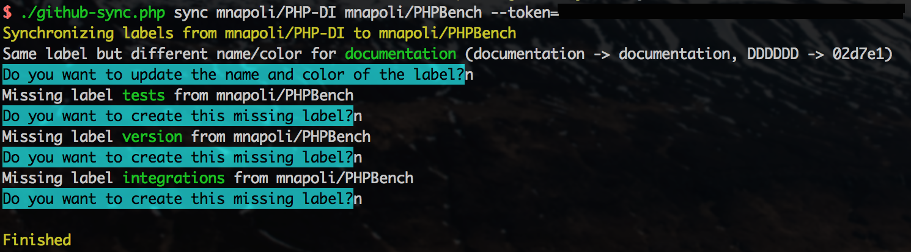

# GitHub synchronizer

This script lets you synchronize labels and milestones between different GitHub repositories.

## Installation

Clone the repository and install composer dependencies:

```
git clone https://github.com/piwik/github-sync
cd github-sync
composer install
```

## Usage

Simply run the `github-sync.php` script to see how to use the command:

```
./github-sync.php help sync
```

Here is an example of the full command line:

```
./github-sync.php sync piwik/piwik piwik/plugin-SiteMigration --token=12345abcd
```



The script will ask you before doing any modification so don't be afraid to run it to see if it works.

You can provide a GitHub *Personal Access Token* using the `--token` option. This is necessary if you want to create/delete/update labels and milestones. If you just want to try out the script without doing any modification, you don't need to provide a token.

### Bulk synchronizing

You can synchronize multiple repositories:

```
./github-sync.php sync piwik/piwik piwik/plugin-SiteMigration piwik/plugin-TasksTimetable
```

Here the `plugin-SiteMigration` and `plugin-TasksTimetable` repositories will both be synchronized to `piwik/piwik`.

Additionally, you can use the `*` wildcard to synchronize with all you repositories matching the pattern:

```
./github-sync.php sync piwik/piwik "piwik/*"
```

_Note: `*` can be interpreted by your shell, in that case use quotes as shown in the example above._

## License

This tool is released under the LGPL v3.0.
